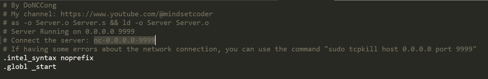

# Run a simple server by assembly language.

## You can edit compile the file by command

as -o Server.o Server.s && ld -o Server Server.o

## You can communicate the server by command:

nc 0.0.0.0 9999

## You can see my video to understand:
[Video Demo](https://youtu.be/A2z7equv7M8)
